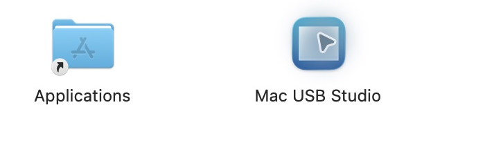
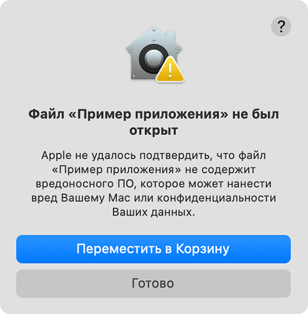
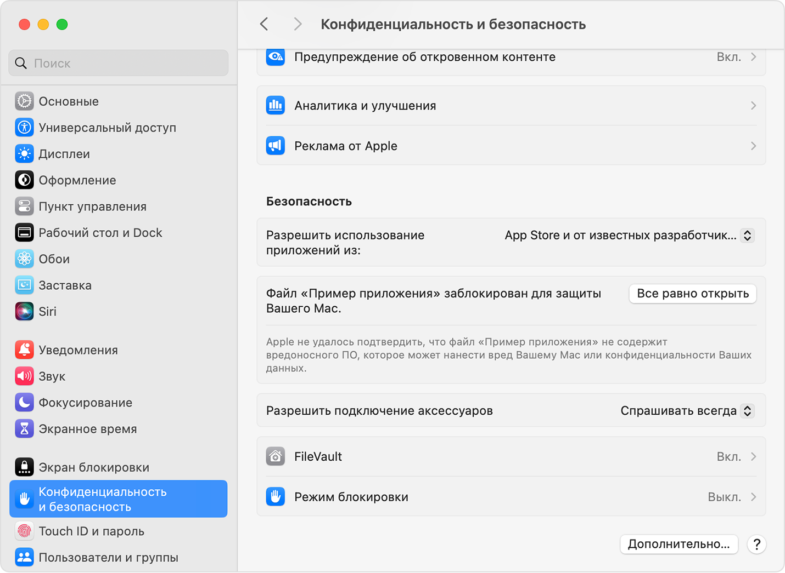
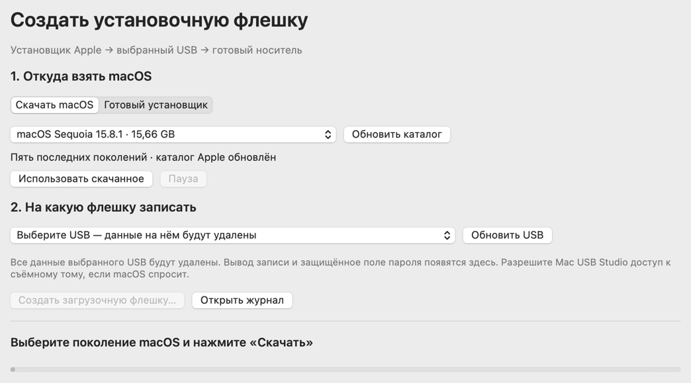

# Установка Mac USB Studio

Версия 2.1.0 (30), macOS 13 или новее, Apple Silicon и Intel. Установка выполняется мышью, без Terminal. Готовое приложение распространяется в **DMG**.

У сборки нет Developer ID и нотарификации Apple. При первом запуске macOS может потребовать разрешение в настройках. Выполняйте эти шаги только для файла из [официального репозитория MacUSBStudio](https://github.com/Atlantik56/MacUSBStudio).

## 1. Скачайте DMG

Нажмите **[Скачать Mac.USB.Studio-2.1.0.dmg](https://github.com/Atlantik56/MacUSBStudio/releases/download/v2.1.0/Mac.USB.Studio-2.1.0.dmg)**. Дождитесь окончания загрузки в браузере. Файл обычно появится в папке «Загрузки».

На [странице релиза](https://github.com/Atlantik56/MacUSBStudio/releases/tag/v2.1.0) выбирайте файл с окончанием `.dmg`. Автоматические ссылки GitHub «Source code» содержат исходники для разработчиков.

## 2. Откройте образ

В Finder откройте «Загрузки» и дважды нажмите `Mac.USB.Studio-2.1.0.dmg`. В окне образа появятся приложение **Mac USB Studio** и ярлык **Applications**.

*Скриншот окна распространяемого DMG. Applications — это папка «Программы».*

## 3. Перенесите приложение в «Программы»

Перетащите значок **Mac USB Studio** на значок **Applications**. Дождитесь окончания копирования.

Если устанавливаете обновление, сначала дождитесь окончания записи флешки и закройте старую копию Mac USB Studio. Затем при запросе Finder выберите «Заменить». Если macOS запросит пароль для копирования в «Программы», введите его в системном окне.

Не запускайте приложение непосредственно из образа: сначала скопируйте его.

## 4. Попробуйте открыть приложение

Откройте Finder → **«Программы» → Mac USB Studio** двойным щелчком.

Если приложение сразу открылось, переходите к шагу 7. Если macOS сообщает, что Apple не может проверить приложение или разработчика, нажмите **«Готово»** или **«OK»**. Оставьте приложение в «Программах».

*Официальный пример Apple: в вашем предупреждении вместо «Пример приложения» будет Mac USB Studio. [Источник](https://support.apple.com/ru-ru/102445).*

## 5. Разрешите первый запуск

Откройте меню ** → «Системные настройки» → «Конфиденциальность и безопасность»**. Прокрутите вниз до раздела **«Безопасность»**.

Найдите сообщение о заблокированном **Mac USB Studio** и нажмите **«Все равно открыть»**. В некоторых версиях macOS сначала нужно раскрыть сообщение кнопкой «Открыть».

*Официальный скриншот Apple. Название приложения в примере отличается; у вас разрешение должно относиться к Mac USB Studio. [Источник](https://support.apple.com/ru-ru/102445).*

Если кнопки нет, ещё раз попробуйте открыть приложение из «Программ», затем вернитесь в настройки: кнопка появляется после блокировки и доступна примерно час. На Mac, управляемом организацией, разрешение может быть скрыто политикой администратора. [Инструкция Apple](https://support.apple.com/ru-ru/guide/mac-help/mh40616/mac).

## 6. Подтвердите «Открыть»

В повторном предупреждении нажмите **«Открыть»**. Если macOS запросит пароль пользователя или Touch ID, подтвердите в системном окне.

Разрешение сохраняется для этого приложения. При необходимости снова откройте **«Программы» → Mac USB Studio**. После замены приложения новой сборкой macOS может запросить разрешение ещё раз.

## 7. Начните работу

Должно появиться окно «Создать установочную флешку»:

*Скриншот установленной версии 2.1.0. Выбранная версия macOS и наличие ранее скачанного установщика могут отличаться.*

Выберите «Скачать macOS» или «Готовый установщик», подключите USB и выберите накопитель. Запись начнётся только после вашего подтверждения стирания. **Все данные выбранного USB будут удалены.** Пароль администратора для записи вводится в защищённом поле приложения; доступ к съёмным томам подтверждается в системном запросе macOS.

После копирования приложения образ можно извлечь через Finder → значок извлечения рядом с **Mac USB Studio**. Это отключает образ DMG; установленное приложение остаётся в «Программах».

Установка приложения не создаёт флешку и не устанавливает macOS на внутренний диск. После успешной записи флешки используйте кнопку **«Безопасно извлечь флешку»** в Mac USB Studio.
